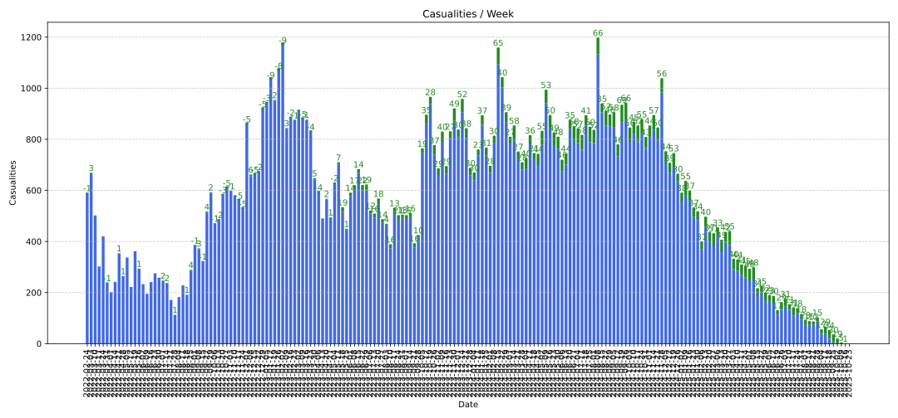

# Confirmed Losses of the Russian Army

## Casualties

As of **2024-02-23**, there have been **44654** confirmed[^1] fatalities.
Of these, **35133** have a known date of death.
**3154** were officers.

## Chart

## Archive

https://thunderquack.github.io/MZCasualitiesExtractor

## Source

https://zona.media/casualties

---

[^1]: "Confirmed" means each death is supported by a name, obituary, tomb photo, etc.
